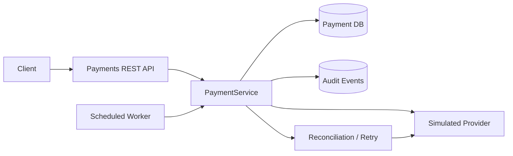

# Distributed Payment Orchestration Engine

Java 21 / Spring Boot backend portfolio project demonstrating idempotency, durable payment state, retries, ambiguous provider outcomes, reconciliation, audit events, and scheduled processing. **Sandbox only: no real money or provider integrations.**

## Quick start (no Docker required)

```bash
mvn clean test
mvn spring-boot:run
```

App listens on **http://localhost:8081** (avoids conflict with AI QA Agent on 8080). Default persistence is an on-disk H2 database in `./data/`.

```bash
curl http://localhost:8081/actuator/health
curl -s -X POST http://localhost:8081/api/v1/payments \
  -H 'Content-Type: application/json' \
  -H 'Idempotency-Key: demo-payment-001' \
  -d '{"merchantId":"timeout-demo","amount":1250.00,"currency":"INR"}'
```

Copy the returned `id` into:

```bash
curl -s -X POST http://localhost:8081/api/v1/payments/<id>/process
curl -s -X POST http://localhost:8081/api/v1/payments/<id>/reconcile
curl -s http://localhost:8081/api/v1/payments/<id>/events
```

The first process call for `timeout-demo` produces `REQUIRES_RECONCILIATION` even though the sandbox provider has accepted the charge. Reconciliation confirms the payment **without another charge attempt**. For a fresh test use a **new idempotency key**.

### Simulated provider behaviors

| Merchant ID prefix | Provider behavior |
|---|---|
| `timeout-` | Provider accepts but response is lost; reconcile to success |
| `decline-` | Terminal decline |
| `retry-` | Transient failure; bounded retry with backoff, then failed |
| Anything else | Immediate success |

A scheduler automatically processes due payments every two seconds. For predictable demonstrations, manually call `/process` immediately after creation.

## Architecture



### API

| Method | Endpoint | Purpose |
|---|---|---|
| POST | `/api/v1/payments` | Create payment; requires `Idempotency-Key` header; returns 202 |
| GET | `/api/v1/payments/{id}` | Inspect payment state |
| POST | `/api/v1/payments/{id}/process` | Process a due payment |
| POST | `/api/v1/payments/{id}/reconcile` | Resolve ambiguous provider result |
| GET | `/api/v1/payments/{id}/events` | Inspect immutable audit events |
| GET | `/actuator/health` | Health check |

### Key engineering decisions

- **Idempotency:** Unique database constraint on `idempotency_key`; same key and payload returns the same payment, conflicting payload returns HTTP 409. Concurrent creation collisions return 409 with a safe retry instruction.
- **Transactional state changes:** JPA transactions and pessimistic row locking serialize processing of the same payment.
- **Retry policy:** Transient failures have bounded attempts and increasing delays.
- **Ambiguous outcomes:** A timeout after provider acceptance is *not* treated as a definitive failure. Reconciliation queries the provider rather than re-charging.
- **Auditability:** Every state transition is recorded in `payment_events`.
- **Background worker:** Scheduled polling resumes pending work after application restarts, subject to provider simulator limitations below.

## PostgreSQL + Docker

Build first: `mvn clean package`. Then `docker compose up --build`. PostgreSQL is mapped to host port 5433; application remains on 8081. Local credentials are development-only.

## Tests

`mvn clean test` runs HTTP-level integration tests for idempotency, conflicts, successful processing, audit events, timeout reconciliation, decline, and invalid requests.

## Known limitations / roadmap

This is a **portfolio MVP**, not a production payment platform. The simulated provider stores its transaction state in memory, so provider-side state is lost when the application restarts; durable real-provider lookup is required for true crash recovery. H2 uses schema auto-update for easy local setup; production would use PostgreSQL + Flyway migrations. The scheduler is intended for one application instance; a production multi-instance deployment needs a distributed work-claim/lease strategy. There is no authentication, real gateway, message broker, webhook signature verification, or financial ledger yet. Do not process real payments or store payment card data.

Next improvements: Kafka transactional outbox, webhook delivery with signatures and retry, Flyway migrations, Testcontainers concurrency tests, metrics dashboards, multi-provider routing and circuit breakers.
