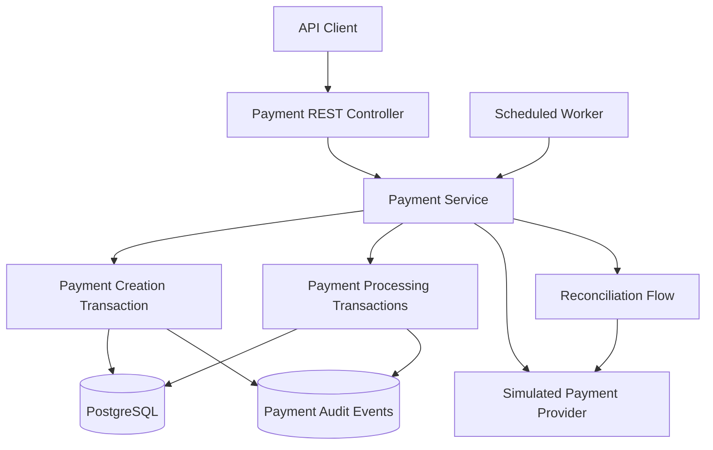

# Distributed Payment Orchestrator

A Java 21 and Spring Boot backend project demonstrating payment orchestration, idempotent APIs, concurrent request handling, transaction management, retry policies, reconciliation, and crash-recovery patterns.

Built as a software engineering portfolio project focused on backend reliability and distributed systems.

> **Sandbox project:** Uses a simulated payment provider. No real payments are processed.

## Tech Stack

- Java 21
- Spring Boot 3.4.5
- Spring Data JPA / Hibernate
- PostgreSQL 16
- H2 for local development and automated tests
- Maven
- Docker and Docker Compose
- JUnit 5 and MockMvc
- GitHub Actions

## Architecture



### Processing Flow

1. A client submits a payment with an idempotency key.
2. The application registers the payment using a database uniqueness constraint.
3. A worker claims the pending payment in a short transaction.
4. The provider is called outside the database transaction.
5. The outcome is persisted in another transaction.
6. Successful and declined payments reach terminal states.
7. Transient failures follow a bounded retry policy.
8. Ambiguous outcomes enter reconciliation rather than being blindly charged again.

## Core Features

### 1. Idempotent Payment Creation

Every payment creation request requires an `Idempotency-Key` header.

- A new key creates a payment.
- Reusing the key with identical payment details returns the existing payment.
- Reusing the key with different payment details returns HTTP 409.
- A database uniqueness constraint prevents duplicate records.
- Concurrent requests with identical details resolve to the same payment.

The implementation was manually verified against PostgreSQL using 10 simultaneous requests, all returning HTTP 202 and the same payment ID.

### 2. Payment State Management

The application manages the following states:

```text
PENDING
   |
   v
PROCESSING
   |
   +----> SUCCEEDED
   |
   +----> FAILED
   |
   +----> PENDING (scheduled retry)
   |
   +----> REQUIRES_RECONCILIATION
                 |
                 +----> SUCCEEDED
                 |
                 +----> REQUIRES_RECONCILIATION
```

Payment attempts, statuses, provider references, and scheduling timestamps are persisted.

### 3. Transaction Management and Concurrency

- Database row locking coordinates updates to the same payment.
- Payment claims and outcome finalization use separate transactions.
- External provider calls execute without holding the payment's database lock.
- Processing leases identify potentially interrupted work.
- Attempt-number fencing helps prevent stale processing results from overwriting newer attempts.
- Expired processing leases are directed toward reconciliation.

These mechanisms demonstrate important concurrency-control patterns but do not constitute a complete exactly-once payment guarantee.

### 4. Retry and Reconciliation

Transient provider failures use bounded retries with increasing delays.

Ambiguous outcomes are handled differently:

- A timeout does not automatically mean the payment failed.
- The application queries the provider for the payment outcome.
- An uncertain lookup keeps the payment in reconciliation.
- The system avoids automatically recharging payments with unresolved outcomes.

### 5. Scheduled Processing

A background scheduler periodically selects payments eligible for processing or reconciliation.

It supports:

- Pending payment processing
- Scheduled retries
- Reconciliation of ambiguous outcomes
- Recovery of expired processing leases

### 6. Payment Audit History

Payment lifecycle events are persisted in the `payment_events` table.

Examples include:

- `PAYMENT_CREATED`
- `PAYMENT_ATTEMPTED`
- `PAYMENT_SUCCEEDED`
- `PAYMENT_FAILED`
- `PAYMENT_REQUIRES_RECONCILIATION`
- `PAYMENT_RECONCILED`

## REST API

| Method | Endpoint | Description |
|---|---|---|
| POST | `/api/v1/payments` | Create an idempotent payment |
| GET | `/api/v1/payments/{id}` | Retrieve payment status |
| POST | `/api/v1/payments/{id}/process` | Trigger processing of an eligible payment |
| POST | `/api/v1/payments/{id}/reconcile` | Request provider reconciliation |
| GET | `/api/v1/payments/{id}/events` | Retrieve payment event history |
| GET | `/actuator/health` | Application health check |

### Example: Create Payment

```bash
curl -sS -X POST http://localhost:8081/api/v1/payments \
  -H "Content-Type: application/json" \
  -H "Idempotency-Key: demo-payment-001" \
  -d '{
    "merchantId": "demo-merchant",
    "amount": 1250.00,
    "currency": "INR"
  }'
```

The API returns HTTP 202 with a payment identifier.

### Check Payment Status

```bash
curl -sS http://localhost:8081/api/v1/payments/<payment-id>
```

### Inspect Audit Events

```bash
curl -sS http://localhost:8081/api/v1/payments/<payment-id>/events
```

Replace `<payment-id>` with the UUID returned by the create request.

## Simulated Provider Scenarios

| Merchant ID prefix | Simulated behavior |
|---|---|
| `decline-` | Provider declines the payment |
| `retry-` | Provider returns a transient failure |
| `timeout-` | Provider accepts the payment but returns an ambiguous timeout |
| Other values | Provider accepts the payment |

The provider maintains its successful-charge records in memory and uses the payment UUID for deduplication during a single application lifetime.

Provider records do not survive application restarts.

## Running Locally

### Prerequisites

- Java 21
- Maven
- Docker Desktop (for PostgreSQL)

### Option A: H2

```bash
mvn clean test
mvn spring-boot:run
```

The application starts on port `8081` and uses a local H2 database by default.

### Option B: PostgreSQL

Start PostgreSQL:

```bash
docker compose up -d postgres
```

Run the application with PostgreSQL configuration:

```bash
DB_URL=jdbc:postgresql://localhost:5433/payments \
DB_USER=payments \
DB_PASSWORD=localdev \
mvn spring-boot:run
```

PostgreSQL is exposed on local port `5433`.

Verify application health:

```bash
curl http://localhost:8081/actuator/health
```

The credentials above are for local development only.

## Automated Testing

The project includes automated tests covering:

- Idempotent payment creation
- Conflicting idempotency keys
- Successful payment processing
- Payment event history
- Timeout reconciliation
- Provider declines
- Invalid payment amounts
- Concurrent duplicate requests
- PostgreSQL-backed concurrent creation
- Processing lease expiration
- Duplicate claim prevention
- Premature reconciliation protection
- Late provider responses and reconciliation precedence

### Run H2 Tests

```bash
mvn clean test
```

### Run H2 and PostgreSQL Tests

Start PostgreSQL first:

```bash
docker compose up -d postgres
```

Then run:

```bash
mvn clean verify -Ppostgres-tests
```

The PostgreSQL integration test uses Maven Failsafe and connects to the local PostgreSQL instance.

## Continuous Integration

GitHub Actions runs the automated test suite on pushes and pull requests.

The workflow:

1. Checks out the repository.
2. Configures Java 21.
3. Starts a PostgreSQL 16 service container.
4. Executes Maven unit and integration tests.
5. Reports the build result in GitHub Actions.

Workflow configuration: `.github/workflows/ci.yml`

## Engineering Trade-offs and Limitations

This project demonstrates payment orchestration and reliability patterns. It is not a production-ready payment gateway.

### Provider Durability

The simulated provider stores transaction outcomes in memory. Its records disappear after restart.

A real integration requires durable provider-side idempotency and reliable payment-status lookup.

### Exactly-Once Processing

Database uniqueness constraints, processing leases, and attempt fencing reduce duplication and stale updates.

They do not independently guarantee exactly-once external charging.

### Distributed Coordination

The implementation uses database locks and scheduled polling. Additional testing and coordination would be needed for reliable multi-instance operation.

### Schema Management

Hibernate schema auto-update is convenient for local development. Production systems should use versioned migrations such as Flyway.

### Security and Financial Infrastructure

The project does not implement authentication, real payment gateway credentials, payment card handling, financial ledger accounting, or webhook verification.

## Future Improvements

- Durable provider simulator or real provider sandbox integration
- Testcontainers-based PostgreSQL testing
- Versioned Flyway database migrations
- Transactional outbox and event publishing
- Metrics and distributed tracing
- Multi-instance scheduler coordination
- Provider circuit breakers and routing

## Purpose

This project was built to explore practical backend engineering problems relevant to financial systems:

- How can an API safely handle duplicate requests?
- How should concurrent workers coordinate payment processing?
- What happens when a provider accepts a charge but the response is lost?
- How can interrupted processing be recovered?
- Why are idempotency and exactly-once charging different problems?
- How should database transactions be structured around external API calls?
